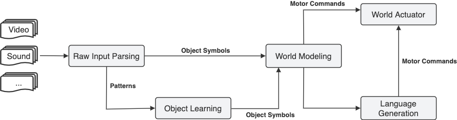
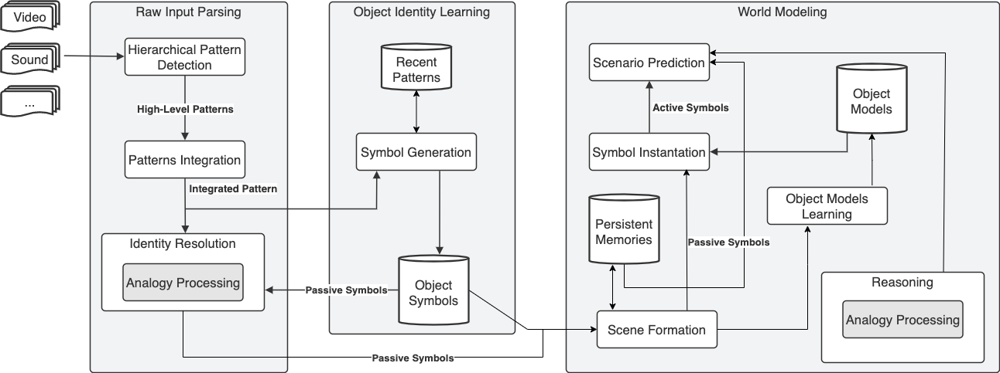

# How to Build a Mind

Any plausible and useful theory of how minds work should be able to answer many questions regarding our empirical evidence with minds and its capabilities. Questions about the nature of learning, abstract thinking, object recognition, language formation, planning, imagination and understanding, are just a few of those.

In our attempts to reverse engineer the human brain (and more generally the animal brain), we may also find it useful to ponder on the nature of some abnormal behaviors that may shed some light on the overall nature of how minds work. Such behaviors include hallucinations, optical illusions, cognitive biases, etc.

## High Level Architecture

The following description of a plausible cognitive architecture is an oversimplification of what the human mind, or even an animal mind, is likely to do in practice, but it may serve as a template to know what a first attempt at an integrated cognition system would need in order to even vaguely resemble a human mind.

## Detailed Architecture

The following diagram depicts several ideas that many researchers in AI/ML have had since the inception of the field. For example, many modern researchers agree on the general idea that the mind must have some sort of predictive model of the world, which enables us to act intelligently, and that such a model is likely to be capable of running as a simplified simulation of slices of the world. The existence of this model would explain our ability to dream and imagine things, to plan ahead and have empathy for others, among many other things.

